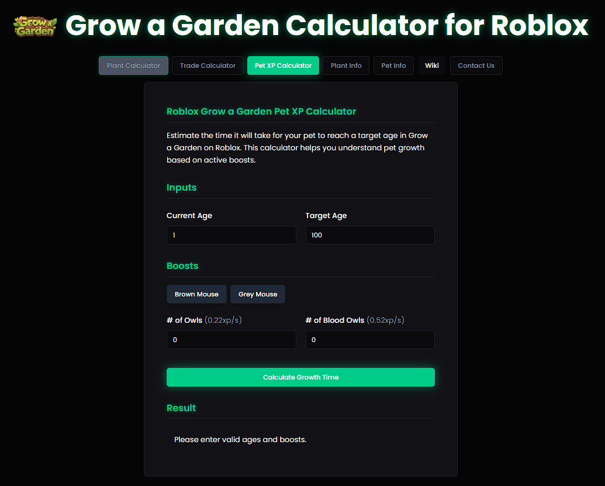

# 🌱 Grow a Garden Calculator

The ultimate **Roblox Grow a Garden Calculator** for players who want to maximize their in-game progress. Calculate plant values, pet XP growth, and browse detailed information about all plants and pets in the game.

## ✨ Features

### 🧮 Plant Value Calculator
- **Accurate calculations** for all 100+ plants with mutations
- **Real-time value updates** as you select modifiers
- **Growth, temperature, and environmental mutations** support
- **Formula breakdown** showing step-by-step calculations
- **Search and filter** plants by category and rarity
- **Mutation combinations** with precise multipliers

### 🐾 Pet XP Calculator
- Calculate XP requirements for pet leveling (1-100)
- Track pet progression and hunger management
- Detailed pet information with abilities and stats
- Hatch chance calculator for all egg types
- Pet feeding cost optimization

### 📊 Comprehensive Database
- **100+ plants** with detailed stats, images, and growth times
- **60+ pets** with abilities, hatch chances, and feeding requirements
- **25+ mutations** with accurate multipliers and combinations
- **Event content** including seasonal and limited-time items
- Regular updates synchronized with game patches

### 🎨 Modern UI/UX
- **Responsive design** optimized for desktop, tablet, and mobile
- **Dark theme** designed for comfortable gaming sessions
- **Lightning-fast search** with instant filtering
- **Interactive components** with smooth animations
- **Accessibility features** for all users
- **SEO optimized** for search engine visibility

## 🚀 Live Demo

**🌐 Visit the Calculator:** [growagardencalculator.in](https://www.growagardencalculator.in/)

### Quick Links

- 🧮 [Plant Calculator](https://www.growagardencalculator.in) - Main calculator tool

- 🐾 [Pet XP Calculator](www.growagardencalculator.in/pet-xp-calculator) - Pet progression tool

- 🌿 [Plant Database](www.growagardencalculator.in/plant-info) - Complete plant information

- 🐕 [Pet Database](www.growagardencalculator.in/pet-info) - All pets and abilities

- 📞 [Contact](www.growagardencalculator.in/contact) - Get in touch

## 📸 Screenshots

### 🧮 Plant Calculator Interface

*Real-time plant value calculation with mutation support*

### 🐾 Pet XP Calculator

*Track pet progression and optimize feeding strategies*

### 📱 Mobile Responsive Design

*Fully optimized for mobile gaming sessions*

## 🎮 Supported Game Content

### 🌱 Plants Database (100+)
#### Seed Shop Plants (22)
- **Basic**: Carrot, Potato, Tomato, Corn, Wheat
- **Intermediate**: Apple, Orange, Lemon, Watermelon, Pumpkin
- **Advanced**: Dragonfruit, Starfruit, Cactus, Bamboo
- **Premium**: Golden Apple, Diamond Carrot, Rainbow Corn

#### Event Plants (30+)
- **Easter Event**: Easter Egg Plant, Bunny Carrot, Chocolate Tree
- **Halloween**: Pumpkin King, Ghost Pepper, Candy Corn
- **Christmas**: Christmas Tree, Candy Cane, Gingerbread
- **Summer**: Beach Ball Plant, Sunflower, Ice Cream Tree

#### Exotic & Rare Plants (50+)
- **Mythic**: Void Plant, Celestial Flower, Time Crystal
- **Legendary**: Phoenix Fruit, Dragon Scale, Unicorn Horn
- **Epic**: Lightning Rod, Storm Cloud, Thunder Fruit

### 🐾 Pet Collection (60+)
#### Common Pets
- **Farm Animals**: Cow, Pig, Chicken, Sheep, Horse
- **Household**: Cat, Dog, Rabbit, Hamster, Bird

#### Rare & Mythic Pets
- **Dragons**: Fire Dragon, Ice Dragon, Shadow Dragon
- **Mythical**: Phoenix, Unicorn, Griffin, Pegasus
- **Legendary**: Void Walker, Time Keeper, Star Guardian

### ⚡ Mutation System (25+)
#### Growth Mutations
- **Rainbow** (×50 multiplier) - Ultimate growth mutation
- **Gold** (×20 multiplier) - Premium growth enhancement
- **Silver** (×10 multiplier) - Advanced growth boost
- **Shiny** (×5 multiplier) - Basic growth improvement

#### Temperature Mutations
- **Frozen** (×3 multiplier) - Cold temperature effect
- **Chilled** (×2 multiplier) - Cool temperature effect
- **Cooked** (×4 multiplier) - Warm temperature effect
- **Burnt** (×6 multiplier) - Hot temperature effect
- **Molten** (×8 multiplier) - Extreme heat effect

#### Environmental Mutations
- **Celestial** (×15 multiplier) - Space environment
- **Disco** (×12 multiplier) - Party environment
- **Voidtouched** (×25 multiplier) - Void environment
- **Crystalline** (×18 multiplier) - Crystal cave environment

## 🎯 Key Features Deep Dive

### 🧮 Advanced Plant Calculator
- **Multi-mutation support**: Combine up to 5 different mutations
- **Real-time calculations**: Instant updates as you change inputs
- **Formula transparency**: See exactly how values are calculated
- **Comparison mode**: Compare different plant configurations
- **Export results**: Save calculations as images or text

### 🐾 Comprehensive Pet System
- **XP progression tracking**: Level 1-100 with accurate requirements
- **Feeding optimization**: Calculate most cost-effective feeding strategies
- **Ability database**: Complete list of all pet abilities and effects
- **Hatch probability**: Accurate egg opening chances for all rarities
- **Pet comparison**: Side-by-side pet stat comparisons

### 📊 Data Accuracy Guarantee
- **Game-synchronized**: Updated within 24 hours of game patches
- **Community-verified**: Data verified by experienced players
- **Version tracking**: Historical data for different game versions
- **Error reporting**: Built-in system for reporting data inconsistencies

### ⚖️ Legal Disclaimers
- **Not Affiliated**: This tool is not officially affiliated with Roblox Corporation or the Grow a Garden game developers
- **Game Data**: All game data is publicly available information gathered from community sources
- **Accuracy**: While we strive for accuracy, game values may change with updates
- **Educational Use**: This tool is created for educational and entertainment purposes

### 🔒 Terms of Service
By using this calculator, you agree to:
- Use the tool responsibly and ethically
- Not attempt to exploit or hack the service
- Respect other community members
- Follow Roblox's Terms of Service when using game data

---

---

## 🚀 Ready to Start Calculating?

**[🌱 Open the Calculator](https://www.growagardencalculator.in/)** and start optimizing your Grow a Garden gameplay today!

**Made with ❤️ for the Roblox Grow a Garden community**

